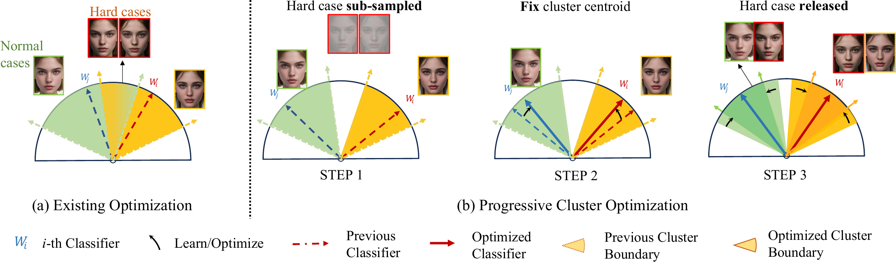
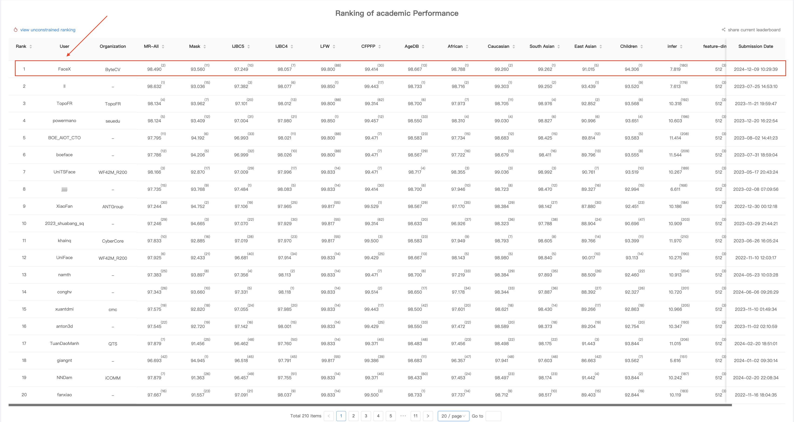

<h2 align="center"> <a href="https://arxiv.org/abs/2501.13420v2">[ICCV 2025 Highlight] LVFace: Progressive Cluster Optimization for Large Vision Models in Face Recognition</a></h2>

<h5 align="center">If you like LVFace, please give us a star ⭐ on GitHub for the latest update. </h5>

<h5 align="center">
<a href='https://arxiv.org/abs/2501.13420v2'></a>
<a href="https://huggingface.co/ByteDance/LVFace">
    
</a>
<a href="https://github.com/bytedance/LVFace">
   
</a>
<a href="https://opensource.org/license/MIT">
    
</a>
</h5>

<div align="center">
<!-- <h5 align="center"> -->
This is the official PyTorch implementation for the inference of LVFace .Drawing inspiration from the massive data support, multi - stage training paradigm, and Transformer architecture of large - model technology, this method, based on Large Vision Transformer, has carried out progressive optimization of the face clustering space through multiple stages on massive datasets.
<!-- </h5> -->
</div>

<div align="center">

</div>

<br>

## News  
- 🔥🔥🔥 We have released the training weights of LVFace. Please click [here](https://huggingface.co/bytedance-research/LVFace/tree/main) to download it. (August, 2025 UTC)
- 🎉🎉🎉 LVFace has been recommended as **ICCV Highlight**. (July, 2025 UTC)
- 🎉🎉🎉 LVFace is accepted by **ICCV 2025**. (July, 2025 UTC)
- 🔥🔥🔥 We have updated the arXiv report of LVFace. Please click [here](https://arxiv.org/abs/2501.13420v2) to view it. (March, 2025 UTC)
- 🎉🎉🎉 LVFace secured **1st place** in the ICCV 2021 Masked Face Recognition (MFR)-Ongoing Challenge (academic track). (December, 2024 UTC)
<div align="center">

</div>

## Requirements  
All required dependencies are listed in `requirements.txt`:  

```txt
onnxruntime-gpu==1.19.2
torch torchvision torchaudio --index-url https://download.pytorch.org/whl/cu124
scikit-image
insightface
numpy==1.23
```

Install all dependencies with a single command: pip install -r requirements.txt

## Datasets  
Test datasets for inference validation can be downloaded from the following sources:  

- **IJB-C & IJB-B**: [Google Drive](https://drive.google.com/file/d/1aC4zf2Bn0xCVH_ZtEuQipR2JvRb1bf8o/view)  
- **MFR-Ongoing**: [Challenge Page](https://insightface.ai/mfr_ongoing)  

## LVFace Pretrained Models  
Pretrained model weights for inference are available below in both ONNX and PyTorch (.pt) formats:  

| Training Data | Model         | IJB-C(1e-6) | IJB-C(1e-5) | IJB-C(1e-4) | IJB-B(1e-4) | Download |
|---------------|---------------|-------------|-------------|-------------|-------------|---------------|
| Glint360K     | LVFace-T      | 88.53       | 95.63       | 96.67       | 95.41       | [HuggingFace](https://huggingface.co/bytedance-research/LVFace/tree/main/LVFace-T_Glint360K) |
| Glint360K     | LVFace-S      | 90.06       | 96.52       | 97.31       | 96.14       | [HuggingFace](https://huggingface.co/bytedance-research/LVFace/tree/main/LVFace-S_Glint360K) |
| Glint360K     | LVFace-B      | 90.06       | 97.00       | 97.70       | 96.51       | [HuggingFace](https://huggingface.co/bytedance-research/LVFace/tree/main/LVFace-B_Glint360K) |
| Glint360K     | LVFace-L      | 89.51       | 97.02       | 97.66       | 96.51       | [HuggingFace](https://huggingface.co/bytedance-research/LVFace/tree/main/LVFace-L_Glint360K) |
| WebFace42M    | LVFace-B      | -           | -           | -           |  -          | come soon |


## Step-by-Step Usage Guide

**1. Installation & Environment Setup**
  
   First, clone the repository and navigate to the project directory:
   ```bash
   # Clone the LVFace repository
   git clone https://github.com/bytedance/LVFace.git
   
   # Enter the project directory
   cd LVFace
   ```  

   Then install all required dependencies using the provided `requirements.txt`:
   ```bash
   # Install dependencies
   pip install -r requirements.txt
   ```


**2. Download Pretrained Models**  
   Download the ONNX-format pretrained weights from the [LVFace Pretrained Models](https://huggingface.co/ByteDance/LVFace/tree/main) section, then place them in a directory (e.g., `./LVFace_model/`). 


**3. Run Inference**  
   Execute the `inference_onnx.py` script to perform feature extraction and similarity calculation. A complete workflow example:  
   ```python
   ## Initialize the inferencer from inference_onnx.py
   inferencer = LVFaceONNXInferencer(
      model_path="./models/vit_b_dp005_mask_005.onnx",  # Path to your ONNX model
      use_gpu=True  # Set to False for CPU-only inference
   )
   
   ## Extract feature from local image
   feat1 = inferencer.infer_from_image("path/to/image1.jpg")

   ## Extract feature from URL
   feat2 = inferencer.infer_from_url("https://example.com/image1.jpg")

   ## Calculate cosine similarity
   similarity = inferencer.calculate_similarity(feat1, feat2)
   print(f"Similarity score: {similarity:.6f}")  # Output example: 0.892345
   ```
   **Note**: The `LVFaceONNXInferencer` class is defined in `inference_onnx.py`, which handles ONNX model loading, image preprocessing, feature extraction, and similarity calculation in a unified interface. Ensure the model path and image paths are correctly specified before running.


## Model Evaluation  

**Evaluation Steps** 
1. Modify the test dataset path (e.g., IJB-C, IJB-B) in the corresponding evaluation script (`eval_ijbc.py`).  

2. Run the evaluation with pretrained model weights using the commands below:  


**Evaluation Commands**  

```bash
python eval_ijbc.py \
  --model-prefix path/to/LVFace-B_Glint360K.pt \
  --result-dir results \
  --network vit_b_dp005_mask_005 > LVFace-B_Glint360K.log 2>&1 &
```


## License
The code of LVFace is released under the MIT License. There is no limitation for both academic and commercial usage.

The models downloaded from our repo follow the above license policy (which is for non-commercial research purposes only).


## Citation  
If you find this work useful, please cite our paper and give us a star ⭐:  
```bibtex
@article{you2025lvface,
  title={LVFace: Progressive Cluster Optimization for Large Vision Models in Face Recognition},
  author={You, Jinghan and Li, Shanglin and Sun, Yuanrui and Wei, Jiangchuan and Guo, Mingyu and Feng, Chao and Ran, Jiao},
  journal={arXiv preprint arXiv:2501.13420},
  year={2025}
}
```

## Acknowledgments  
We sincerely thank **Professor Deng Jiankang** for his valuable guidance and insights throughout the research. 

We also appreciate the [InsightFace](https://github.com/deepinsight/insightface/tree/master/recognition/arcface_torch) for their excellent and research support.  